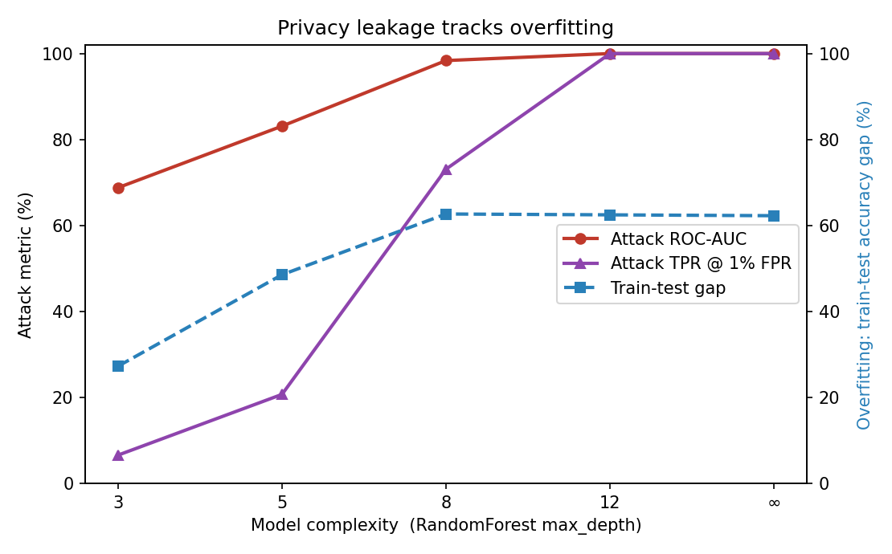
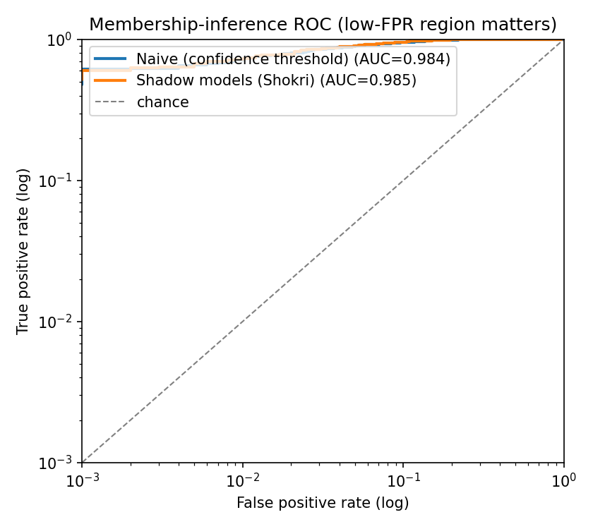
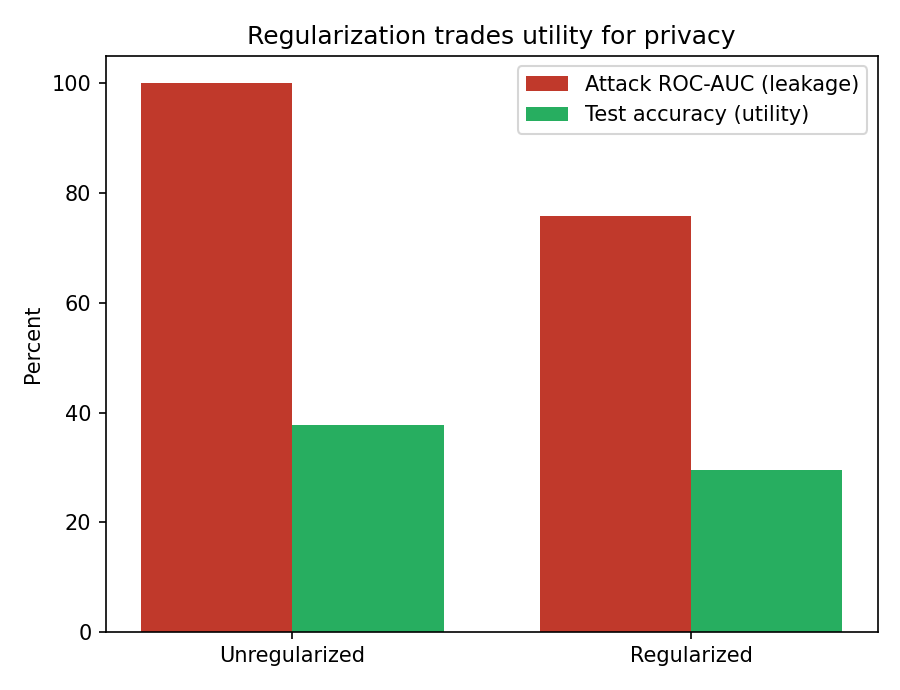

# Your Model Remembers: Membership Inference and the Privacy Cost of Overfitting

*A reproducible mini-study. Author: Daniel Duong. Code: this repository.*

## Abstract

A trained model can leak whether a *specific record was in its training set*. This is a
**membership-inference (MI)** attack — the most basic privacy failure of machine
learning, and the foundation under more dramatic ones like extracting verbatim training
data from large language models. We build a small, fully reproducible testbed: a
RandomForest target trained on a hard 10-class task, attacked two ways — a **naive**
confidence threshold and a **shadow-model** (Shokri et al.) attack — and scored with
ROC-AUC and, crucially, **TPR @ 1% FPR**, the low-false-positive metric Carlini et al.
argue actually reflects privacy risk.

The findings are clean and a little alarming. **Leakage tracks overfitting.** Sweeping
model complexity, attack AUC climbs from **0.69** (a shallow, weak model) to **1.000**
(an unconstrained one), and at high complexity the attack identifies **100% of training
members at a 1% false-positive rate** — every training record is confidently
re-identifiable. Regularization helps but is not free: constraining tree depth cuts
leakage (AUC **1.000 → 0.758**, TPR@1%FPR **100% → 11.4%**) while also lowering test
accuracy (**37.7% → 29.5%**) — a real **privacy/utility tradeoff**. The shadow attack
modestly improves low-FPR detection over the naive one (TPR@1%FPR 73.1% → 73.5% on the
mid-complexity target), confirming that calibration matters most in the subtle regimes.

---

## 1. Motivation

If an adversary can tell that *your* medical record, photo, or message was used to train
a model, that alone is a privacy breach — and it is the building block of training-data
*extraction*, which has been demonstrated against production language models [4]. Yeom
et al. established the tight link between this leakage and **overfitting** [3]; Shokri et
al. introduced the **shadow-model** attack [1]; and Carlini et al. showed that
average-case metrics badly understate the risk, advocating evaluation at **low false
positive rates** [2]. This project reconstructs that chain — attack, metric, and defense
— honestly, end-to-end, on a laptop with no network.

## 2. Threat model and method

**Data.** A deliberately hard synthetic task (`make_classification`: 10 classes, 50
features, modest separation, *no* label noise). A hard task is the cleanest way to make
a model memorize, which is the condition MI exploits. The attack code is identical for
real models (see README).

**Target & knob.** A `RandomForestClassifier`; `max_depth` is the model-complexity /
overfitting knob. The attacker is assumed to know the target's confidence outputs
(`predict_proba`) — the standard black-box MI setting.

**Attacks.**
- *Naive*: score each example by the log-probability the model assigns to its **true
  label**; members tend to score higher than non-members.
- *Shadow (Shokri)*: train *K=10* shadow models on known in/out splits of auxiliary
  data, learn what a member's confidence vector looks like (a logistic-regression
  attacker over true-class prob, entropy, max prob, margin), and apply it to the target.

**Metrics.** ROC-AUC and balanced accuracy, plus **TPR @ 1% FPR** and **TPR @ 10% FPR**.
The low-FPR number is the one that matters: an attacker who can finger even a slice of
the training set with few false alarms has already won.

## 3. Results

### 3.1 Leakage tracks overfitting

Sweeping `max_depth` on a target trained on 800 members (1000 non-members):

| max_depth | Train acc | Test acc | Train–test gap | Attack AUC | TPR @ 1% FPR |
|---:|---:|---:|---:|---:|---:|
| 3 | 54.0% | 26.7% | 27.3% | 0.688 | 6.6% |
| 5 | 81.4% | 32.8% | 48.6% | 0.831 | 20.7% |
| 8 | 100% | 37.3% | 62.7% | 0.984 | 73.1% |
| 12 | 100% | 37.5% | 62.5% | **1.000** | **100%** |
| ∞ (None) | 100% | 37.7% | 62.3% | **1.000** | **100%** |

Attack power rises hand-in-hand with the overfitting gap. An **unconstrained** forest
memorizes every training point into a pure leaf, so its true-label confidence is a
perfect membership tell — **AUC 1.000, and 100% of members recovered at 1% FPR.**



### 3.2 Why the low-FPR region matters

On the mid-complexity target (`max_depth=8`, AUC ≈ 0.98), a log-scale ROC shows the
attack already achieves **~73% TPR at 1% FPR** — i.e. it can confidently identify nearly
three-quarters of training members while almost never flagging a non-member. The
shadow-model attack tracks or slightly beats the naive one here; when the target is this
overfit, the attacker barely needs calibration.



### 3.3 Regularization: a defense with a bill attached

Comparing the unconstrained target to a regularized one (`max_depth=4`):

| Target | Test accuracy (utility) | Attack AUC (leakage) | TPR @ 1% FPR |
|---|---:|---:|---:|
| Unregularized (`max_depth=None`) | 37.7% | 1.000 | 100% |
| Regularized (`max_depth=4`) | 29.5% | 0.758 | 11.4% |

Regularization slashes leakage (AUC 1.000 → 0.758; TPR@1%FPR 100% → 11.4%) — but costs
**8 points of test accuracy** on this hard task. There is no free lunch: the same
memorization that leaks membership is partly what was fitting the data.



## 4. Findings

1. **Membership leakage is a symptom of overfitting.** The attack's AUC and (especially)
   its TPR at low FPR rise monotonically with the train–test gap.
2. **Report TPR at low FPR, not just AUC.** A model can look "moderately" leaky on
   average yet allow confident re-identification of a meaningful subset of its training
   data — the breach that actually matters.
3. **Unconstrained memorizers are catastrophic.** A fully-grown tree ensemble is
   perfectly attackable (every training point identifiable). Capacity controls are a
   privacy control, not just a generalization one.
4. **Defenses cost utility.** Regularization reduces leakage but lowers accuracy;
   principled privacy needs a principled mechanism (differential privacy), not just less
   capacity.

## 5. Limitations

- **Synthetic data** is cleaner than real corpora; the absolute numbers (and the AUC=1.0
  worst case) are partly a function of the hard, noiseless task. The *shape* of the
  result — leakage rising with overfitting, low-FPR mattering, defenses costing utility —
  is the transferable part.
- **One model family, one knob.** Only `max_depth` is swept; no neural nets, no
  per-example LiRA likelihood-ratio test [2], no differential privacy.
- **Black-box confidence access** is assumed; label-only and white-box settings differ.

## 6. Future work

- Implement the full **LiRA** per-example likelihood-ratio attack [2] and compare its
  low-FPR power to the naive/Shokri attacks here.
- Add **DP-SGD** [5] as a principled defense and trace the privacy (ε) ↔ accuracy ↔
  attack-AUC frontier.
- Re-run on **real models/datasets** (CIFAR/MNIST CNNs, a fine-tuned text classifier)
  and connect to **training-data extraction** from language models [4].

## 7. Reproducibility

```bash
pip install -r requirements.txt
python scripts/run_all.py        # attack demo -> overfit sweep -> defense
python tests/test_smoke.py
```

Seeded (`SEED = 20260617`) and byte-reproducible across `PYTHONHASHSEED`. Numbers land in
`results/` (`attack_demo.json`, `overfit_sweep.csv`, `defense.json`); figures in
`results/figures/`.

## 8. Responsible-research note

The target is trained on synthetic records; no real personal data is used. The
repository is a **defensive** demonstration of a privacy vulnerability and how model
choices affect it.

## References

1. Shokri, Stronati, Song, Shmatikov, "Membership Inference Attacks Against Machine
   Learning Models" (IEEE S&P 2017). https://arxiv.org/abs/1610.05820
2. Carlini et al., "Membership Inference Attacks From First Principles" (LiRA; IEEE S&P
   2022). https://arxiv.org/abs/2112.03570
3. Yeom, Giacomelli, Fredrikson, Jha, "Privacy Risk in Machine Learning: Analyzing the
   Connection to Overfitting" (IEEE CSF 2018). https://arxiv.org/abs/1709.01604
4. Carlini et al., "Extracting Training Data from Large Language Models" (USENIX Security
   2021). https://arxiv.org/abs/2012.07805
5. Abadi et al., "Deep Learning with Differential Privacy" (CCS 2016).
   https://arxiv.org/abs/1607.00133
